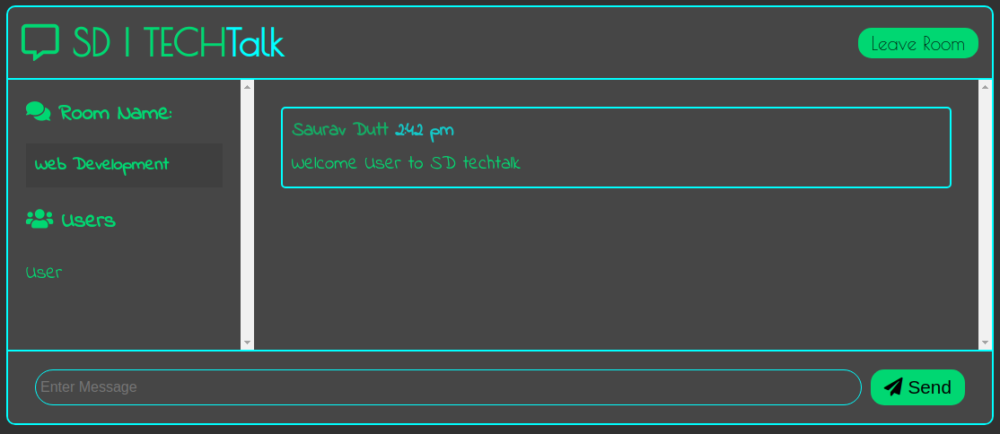

# SD | TECHTalk

Techtalk, is an open source chat room chat application. Built with pure JavaScript(vanilla js), Node js, Express and Socket.io.
Feel free to download and use the code in your projects for any suggestion you can wright me at info@sauravdutt.info. The functioning of this application is pretty simple, there are two ways of using it either by signing up and then loging in or by trying out without any registration. 
After Clicking try-out the following section opens, 
  
Fill in any username of your choice and then choos a room of your interest, and press join chat.
This will take you to the following section or the chat room :-  
  
Thank you for reading this bullshit, I hope you have a Good Day.
